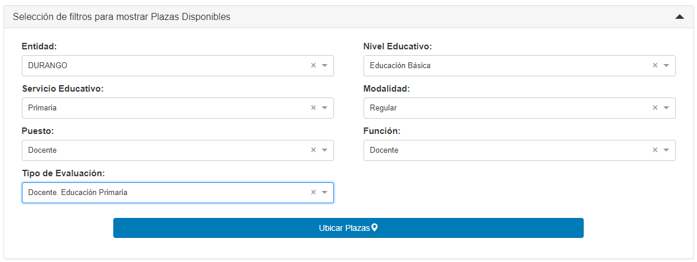
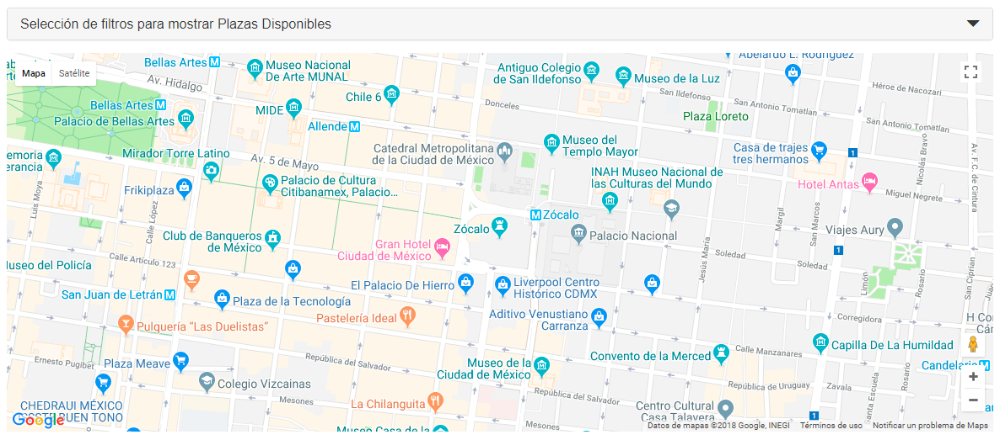
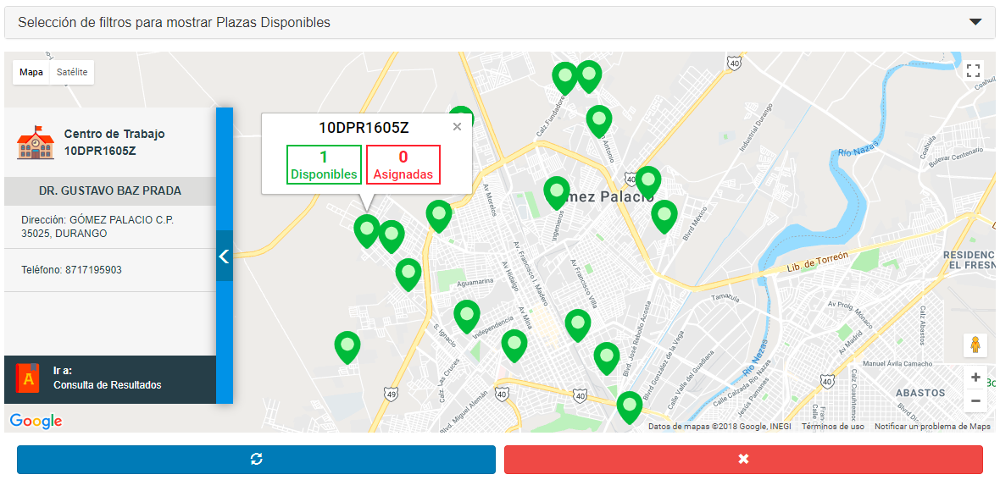

# SAP-Map with React

Web Application using Google Maps API with Front-End using React, developed by [William Velazquez](https://twitter.com/@WilliamVlazquez).

## Application description

Web Application that shows filters with a map where you can see the registered places where
are vacancies available/unavailable and information about that place.

## Functionality

- Filter validation
- Mexico Map
- Markers of different places
- Custom Markers
- Find information about the selected place
- Update Information
- Delete current Markers

## Installation

With npm:
```
npm install
```

With Yarn:
```
yarn
o
yarn install
```

## Usage

For development:
```
npm run build:dev
```

For production:
```
npm run build:prod
```
> **Note:** In the production case you must update the path for the js and css generated files at index.js

## Author & Credits
- [William Velazquez](https://twitter.com/@WilliamVlazquez)

## License

[MIT](https://opensource.org/licenses/MIT)


## Screenshots





